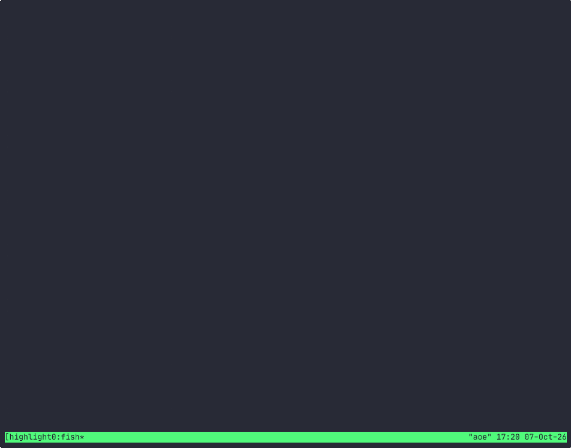

# Quick Start

## Launch the TUI

```bash
aoe
```

| Key | Action |
|-----|--------|
| `n` | New session |
| `b` | New session from a saved project |
| `p` | Manage saved projects |
| `Enter` | Attach to a session |
| `d` | Delete a session |
| `t` | Toggle Agent / Terminal view |
| `D` | Open the [diff view](guides/diff-view.md) |
| `/` | Search sessions |
| `F4` | Filter by session and project highlights |
| `F6` | Project context menu (project header selected) |
| `?` | Full keymap |
| `q` | Quit |
| `Ctrl+b d` | Detach from the tmux session |

## Your first session

Press `n` and fill in the path to your project (or leave `.`), or run `aoe add /path/to/project`. The session appears in the dashboard as **Idle**. Select it and press `Enter` to attach; you are now inside a tmux session running the agent. `Ctrl+b d` detaches back to the TUI. If aoe itself runs inside tmux, attaching switches your client to the agent's session and `Ctrl+b L` switches back.

Press `t` to toggle between the structured view and the paired shell terminal, where you can run builds and git commands without interrupting the agent.

## Projects and groups

A **project** is a saved directory path you register once so you can start sessions from it without retyping. Registering is only a convenience: `n` and `aoe add <path>` work on any path. Add one with `aoe project add /path/to/repo`, or press `p` in the TUI and then `a`. Once a project exists, `b` starts a session from it. See [Multi-repo workspaces](guides/multi-repo-workspaces.md#the-project-registry).

A **group** is unrelated: it is a label you assign to existing sessions to sort them in the sidebar, set by right-clicking a session in the TUI sidebar (**Move to group** / **Remove from group**), from the rename dialog, or with `aoe group move`. Projects are where sessions start; groups are how they are bucketed once they exist. See [the grouping axes](guides/web/dashboard.md#sorting-and-grouping).

## Highlight filters



Press `F4`, or choose **Filter session and project highlights** in the `Ctrl+K` command palette. Use arrows or Tab to move, and Space to toggle colors. Multiple colors in one selector match any of them; session and project selectors must both match. **All** means no restriction, and **None** means unhighlighted. Press `c` or activate **Clear both selectors** to reset the draft. Enter applies and closes; Escape cancels the draft. Outside the editor, Escape clears active highlight filters before clearing a committed `/` search. The footer shows active selections. Filters are local to the current TUI, not saved preferences.

Filtering removes nonmatching session rows in every grouping mode, including Archived. Trash remains reachable and is not filtered. Empty pinned projects remain only when their project highlight matches and no session highlight filter is selected. Clear filters before rearranging rows. `/` remains a separate fuzzy search within the filtered list.

While [live mode](guides/live-mode.md) captures keys, exit it before using `F4` or `F6`; filters never redirect the live input target.

In Project grouping (`g`), select a project header and press `F6` or right-click it to assign or clear its highlight. Project aliases and highlights are shared with the web dashboard. If multiple repository paths share a TUI header label, that ambiguous header cannot set a highlight; use the web project's path-specific menu instead. Scratch and multi-repo buckets have their own shared highlights, not the colors of their constituent repositories.

Remote TUI sessions support the same `F4` filter editor and show session and project highlights fetched from the daemon. Changes refresh automatically; remote highlight assignment remains in the web dashboard. Remote Escape clears active filters first, then exits when no filter is active.

## Worktrees

To work on a new branch in its own directory:

```bash
aoe add . -w feat/my-feature -b
```

In the TUI, press `n`, enter a title, and enable Worktree (`Ctrl+P` on the field for an explicit name). Deleting the session offers to clean the worktree up.

Omit `-b` to attach instead: AoE re-uses the worktree for that branch, or checks the branch out into a new one. The TUI and web wizard have an **Attach to existing branch** toggle. Removing a session only cleans up worktrees AoE created. See the [worktrees reference](guides/worktrees.md).

## Resume a Claude conversation

After attaching, run `/resume` in the Claude pane and pick a conversation. AoE captures the session id and persists it, so the next launch reattaches automatically. See [Session resume](guides/session-resume.md).

## Sandboxes and other agents

```bash
aoe add --sandbox .        # run the agent in a container
aoe add -c opencode .      # use a different agent
```

The sandbox mounts your project at `/workspace` and shares authentication through persistent volumes; the TUI has a checkbox for it when a container runtime is available. The agent picker in the new-session dialog lists every detected tool. See the [container sandbox guide](guides/sandbox.md).

## The web dashboard

```bash
aoe serve                  # localhost only
aoe serve --remote         # reachable from your phone over HTTPS
aoe serve --daemon         # run in the background
```

Open the printed URL in any browser for the same sessions, live terminals, and controls, and install it as a PWA for an app-like experience. See the [web dashboard guide](guides/web-dashboard.md).

## Next steps

- [Repo config & hooks](guides/repo-config.md): per-project settings
- [Configuration reference](guides/configuration.md): every setting
- [CLI reference](cli/reference.md): every command and flag
